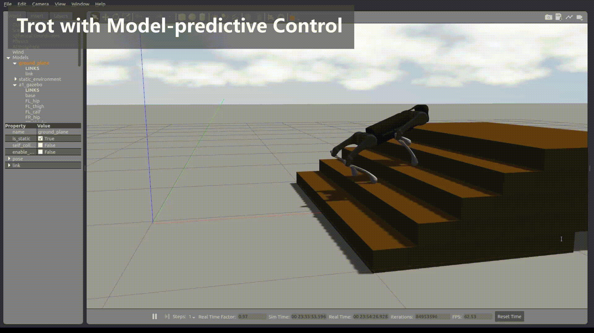

# 1. Overview

This project provides an architecture and many key algorithms to control quadruped robots, including state estimation, gait generation, stance and swing leg controllers.

<!-- This project supports three control modes

- **velocity mode** allows a user to control the robot's linear and angular velocity.
- **position mode** generates user-defined gaits using gait configurations and control the robot's step position .
- **hybrid mode** uses position and torque to implement flexible locomotion.
-->

The project now supports A1 robot (Unitree-Robotics) and Lite3 robot (Deep-Robotics). This project can be easily extended to support other quadruped robots such as AlienGO/GO1 (Unitree-Robotics) and Jueying/X20(Deep-Robotics) by editing some parameters in the control algorithm. For more information about quadruped robots, check out the following websites

- [Unitree Robotics](https://github.com/unitreerobotics)
- [Deep Robotics](https://www.deeprobotics.cn/)
- [Anybotics](https://www.anybotics.com/anymal-autonomous-legged-robot/)

Here are some snapshots in simulation and in real environments

<p align="center">
  
</p>

<p align="center">
  
</p>

Here is a demo for a real quadruped robot (Unitree A1).

<p align="center">
  
</p>


---


# 2. Source Code Structure

The source code includes five major directories

- **demo** has many demo examples to help users understand the software usage and the project architecture itself.
- **extern** contains the third-party dependencies to successfully compile and run the code.
- **navigation** contains the codes for SLAM and navigation.
- **quadruped** contains the core modules defining robots, state, planner, dynamics and supporting algorithms.
- **simulation** contains the configuration to run demos in simulation.

---

# 3. Installation

## 3.1 Install ROS

You need install ROS (Robot Operating System) first. We tested the codes under Ubuntu Linux and ROS 1 Melodic Morenia distribution. Other newer ROS distributions are supposed to be supported. Please visit http://www.wiki.ros.org for ROS installation.

## 3.2 Clone the source code

```
cd ${your_workspace}
mkdir src
cd ${your_workspace}/src
catkin_init_workspace
git clone https://github.com/TopHillRobotics/quadruped-robot/
```

## 3.3 Install the following third party dependencies

* yaml-cpp
* eigen3
* lcm
* glm

```
sudo apt install libyaml-cpp-dev
sudo apt install libeigen3-dev
sudo apt install liblcm-dev
sudo apt install libglm-dev
```

## 3.4 Compile the codes

```
cd ${your_workspace}
catkin_make
```

For a smooth compilation, we suggest using CMake version 3.15 or greater.

---

# 4. Run Demos

## 4.1 Browse the demos

Browse the directories `src/demo/${demo_xxx_xxx}` to find many demo examples. The demo can either run in a Gazebo simulator or in a real environment. We support the robots provided by two companies: unitree-robotics and deep-robotics.

Our locomotion controllers support two modes:  velocity control and position control. Please check out the corresponding demos for the usage.

## 4.2 Run a demo in a simulator

First, in one terminal, source `setup.bash` to set up the development environment

```
source ${your_workspace}/devel/setup.bash
```

Second, run the Gazebo simulator and load a robot.

```
roslaunch unitree_gazebo normal.launch rname:=a1 use_xacro:=true
```

In this command, **rname** specifies the robot you use and **use_xacro** indicates if you use URDF or XACRO description file.

Third, in a new terminal, launch a demo and run the quadruped controller node. Here, a demo helloworld lets the quadruped robot stand up.

```
rosrun demo demo_helloworld sim
```

Here, `sim` indicates that the demo is running in simulation. For more demo examples, please check out the directory /demos. If you have a robot **YAML** configuration file such as  **XACRO** or **URDF**, you can specify the file location to initialize a **qrRobotSim** class. 

## 4.3 Run a demo in a real quadruped robot

You can run a demo for a real quadruped robot either using your own external computer or a built-in miniPC (refer to A1 or Lite2A user manual). If you want to control the robot using your own computer,  you need to connect your computer directly to the real quarduped robot with either an Ethernet cable or WiFi. This network connection allows a robot to exchange messages between your computer and the quarduped. Please check out the A1 or Lite2A user manual for how to build a connection. Some details are given bellow to explain running a demo for a real quadruped robot.

First, in one terminal, source the `setup.bash` to set up the development environment

```
source ${your_workspace}/devel/setup.bash
```

Second,  run `roscore` to start ROS since a real robot use LCM and ROS for communication. Please open a new terminal to run this command

```shell
roscore
```

Third, in a new terminal, launch a demo for a real quadruped, and run the quadruped controller node. The demo helloworld lets the quadruped robot stand up.

```
rosrun demo demo_helloworld real
```

Here, `real` indicates that the demo is running in a real environment using a real quadruped robot. Given a robot **YAML** configuration file such as  **XACRO** or **URDF**, a **qrRobotReal**  object is constructed.

# 5. MPC-WBC controllers

We have now developed an MPC-WBC controller for quadruped. This controller uses [Whole Body Impulse Control](https://arxiv.org/abs/1909.06586#). The controller also includes a finite state machine to stand up, sit down and trot. For more information, please check [MPC-WBC](https://github.com/TopHillRobotics/quadruped-robot/tree/mpc-wbc) branch.

# 6. Feedback and Bugs

Please file bugs and feature requests here: [https://github.com/TopHillRobotics/quadruped-robot/issues](https://github.com/TopHillRobotics/quadruped-robot/issues)

You can help to ensure your issue gets fixed if you provide sufficient detail.

---

# 7. Documentation

Read a [readthedocs](https://quadruped-robot-docs.readthedocs.io/en/main/index.html) for the helps, tutorials, demo explanation.

---
