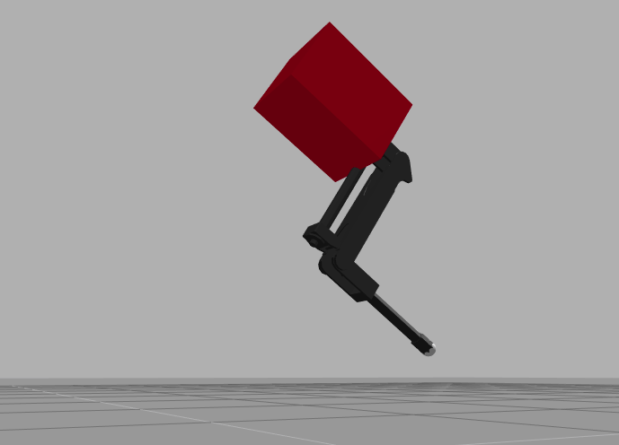

Hopper Environment
==================

Its a simulation of a monopod robot. The original 3D model was created by ETH Zurich,
HopperPage_

.. _HopperPage: https://github.com/ethz-adrl/towr

The simulation was created by TheConstructSim. Its the perfect system to test locomotion
algorithms and AI learning for gait research.

   Hopper Jumps in ROSDS

Robot Environment
*****************

openai_ros.robot_envs.hopper_env module
---------------------------------------

.. automodule:: openai_ros.robot_envs.hopper_env
    :members:
    :undoc-members:
    :show-inheritance:

Task Environments
*****************

.. toctree::
   :maxdepth: 4

   openai_ros.task_envs.hopper
