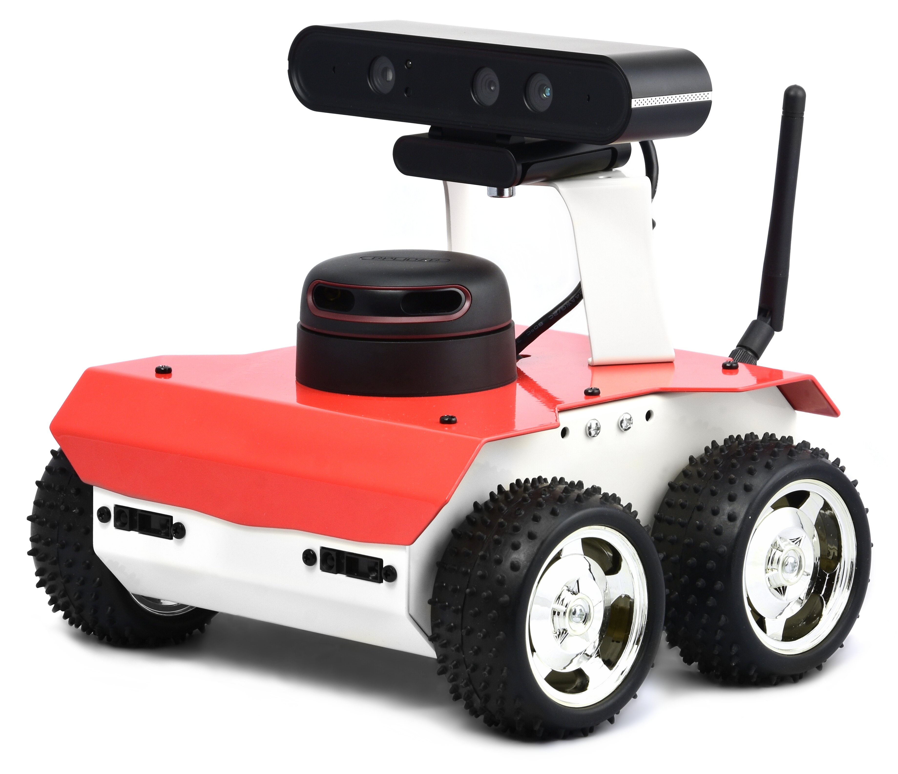
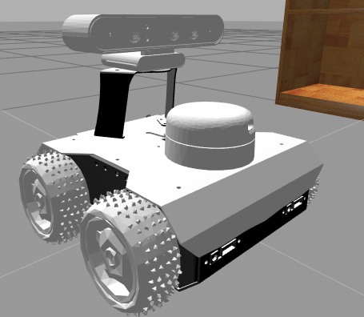

Husarion Environment
====================

ROSbot is an autonomous, open source robot platform.
It can be used as a learning platform for Robot Operating System as well as a base for a variety of robotic
applications like inspection robots, custom service robots and others.
Here you have the link to the real robot: RosBotPage_

.. _RosBotPage: https://husarion.com/#rosbot

The simulation is meant to be a basic wheeled robot for developing navigation and obstacle avoidance AI training.

Robot Environment
*****************

openai_ros.robot_envs.husarion_env module
-----------------------------------------

.. automodule:: openai_ros.robot_envs.husarion_env
    :members:
    :undoc-members:
    :show-inheritance:

Task Environments
*****************

.. toctree::
   :maxdepth: 4

   openai_ros.task_envs.husarion
