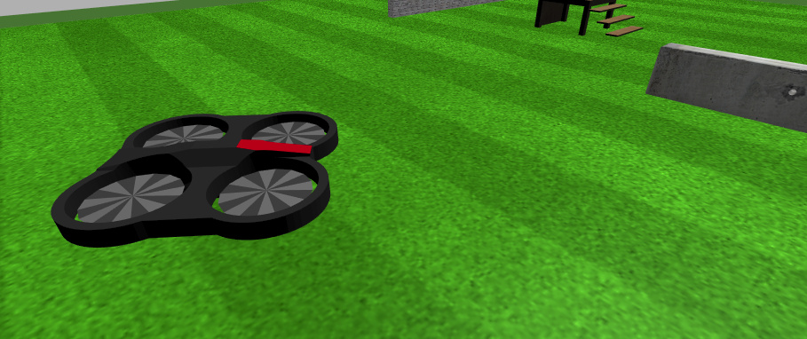

Parrot Drone Environment
========================

Drone simulation to test all your AI algorithms with a flying robot with double cameras and sonar.

Robot Environment
*****************

openai_ros.robot_envs.parrotdrone_env module
--------------------------------------------

.. automodule:: openai_ros.robot_envs.parrotdrone_env
    :members:
    :undoc-members:
    :show-inheritance:

Task Environments
*****************

.. toctree::
   :maxdepth: 4

   openai_ros.task_envs.parrotdrone
