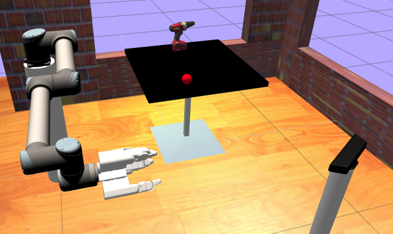

Shadow TC Environment
=====================

This simulation was created by Ugo_Cupcic_ and ShadowHand_. It uses apart from ShadowsHand systems,
a UR5_ robot arm.

.. _Ugo_Cupcic: http://ugocupcic.com/
.. _ShadowHand: https://www.shadowrobot.com/
.. _UR5 : https://www.universal-robots.com/products/ur5-robot/

Robot Environment
*****************

openai_ros.robot_envs.shadow_tc_env module
------------------------------------------

.. automodule:: openai_ros.robot_envs.shadow_tc_env
    :members:
    :undoc-members:
    :show-inheritance:

Task Environments
*****************

.. toctree::
   :maxdepth: 4

   openai_ros.task_envs.shadow_tc
