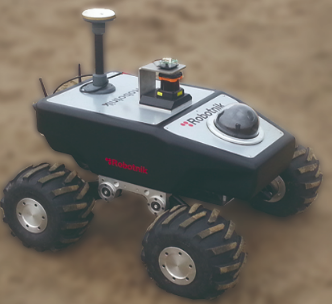
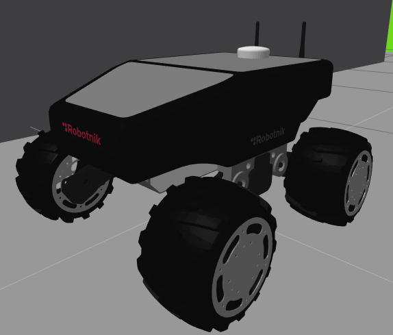

Summit XL Environment
=====================

Summit_XL_ was created by the great Robotnik_ company. The strong mechanical structure allows to carry much heavier
loads and used for research, surveillance, remote monitoring and military applications.

.. _Summit_XL: https://www.robotnik.eu/mobile-robots/summit-xl/
.. _Robotnik: https://www.robotnik.eu/

The simulation is inside a more office like environment.

Robot Environment
*****************

openai_ros.robot_envs.sumitxl_env module
----------------------------------------

.. automodule:: openai_ros.robot_envs.sumitxl_env
    :members:
    :undoc-members:
    :show-inheritance:

Task Environments
*****************

.. toctree::
   :maxdepth: 4

   openai_ros.task_envs.sumit_xl
