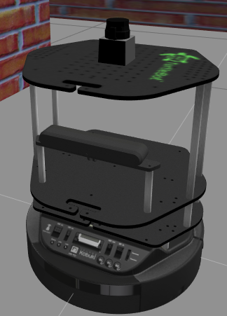

Turtlebot2 Environment
======================

Turtlebot2_ is a classic in ROS robot platforms. In this case, you will find various simulations
with it inside. In ROSDS the default launch one is with an empty worlds and a wall. But you have also
available a world with a maze inside.

.. _Turtlebot2: https://www.turtlebot.com/turtlebot2/

Robot Environment
*****************

openai_ros.robot_envs.turtlebot2_env module
-------------------------------------------

.. automodule:: openai_ros.robot_envs.turtlebot2_env
    :members:
    :undoc-members:
    :show-inheritance:

Task Environments
*****************

.. toctree::
   :maxdepth: 4

   openai_ros.task_envs.turtlebot2
